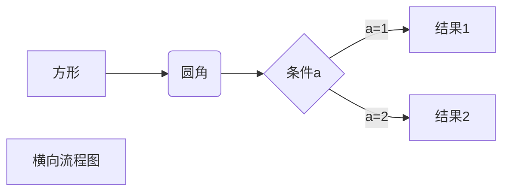
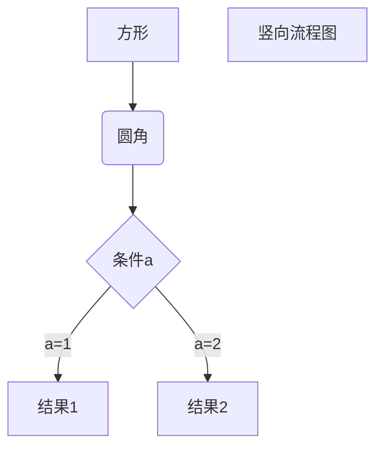
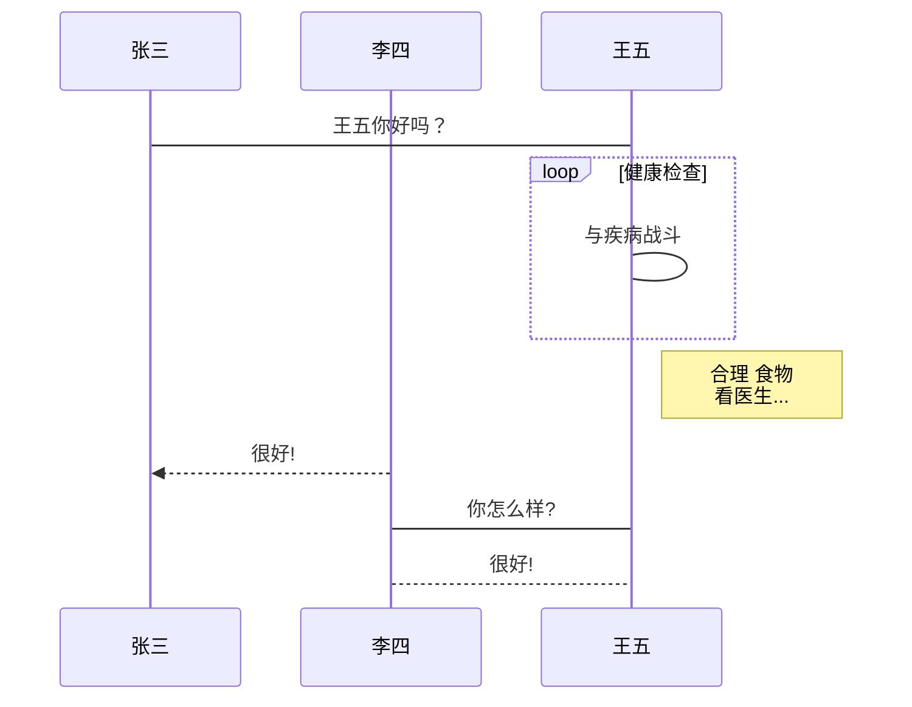
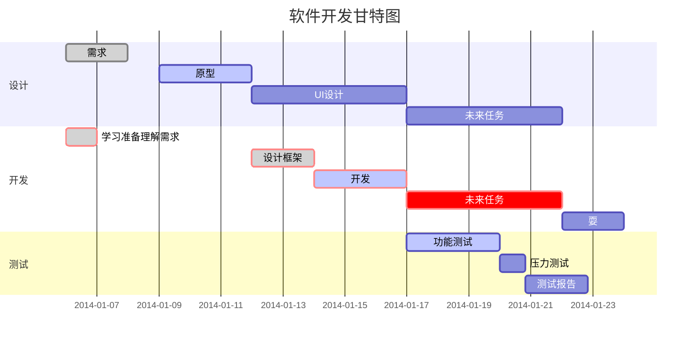
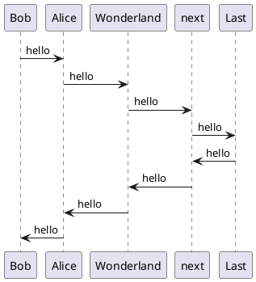

欢迎来到 尘的博客!  
恭喜你发现了彩蛋这是一份 **Markdown 渲染测试文档**。  

## Quick Start

### Create a new post

``` bash
$ hexo new "My New Post"
```

More info: [Writing](https://hexo.io/docs/writing.html)

### Run server

``` bash
$ hexo server
```

More info: [Server](https://hexo.io/docs/server.html)

### Generate static files

``` bash
$ hexo generate
```

More info: [Generating](https://hexo.io/docs/generating.html)

### Deploy to remote sites

``` bash
$ hexo deploy
```

More info: [Deployment](https://hexo.io/docs/one-command-deployment.html)

---





`AnZhiYu主题`中大部分标签移植于[店长](https://akilar.top/)的[hexo-butterfly-tag-plugins-plus](https://www.npmjs.com/package/hexo-butterfly-tag-plugins-plus)，转载请注明来自[安知鱼](https://blog.anheyu.com/posts/d50a.html)



## 1. 段落文本 p



<!-- tab 标签语法 -->

```markdown

```

<!-- endtab -->

<!-- tab 配置参数 -->

1. 字体: logo, code
2. 颜色: ,,,,,
3. 大小: small, h4, h3, h2, h1, large, huge, ultra
4. 对齐方向: left, center, right
   <!-- endtab -->
   <!-- tab 样式预览 -->

- 彩色文字
  在一段话中方便插入各种颜色的标签，包括：、、、、、。
- 超大号文字
  文档「开始」页面中的标题部分就是超大号文字。
  
  
  <!-- endtab -->
  <!-- tab 示例源码 -->

```markdown
- 彩色文字
  在一段话中方便插入各种颜色的标签，包括：、、、、、。
- 超大号文字
  文档「开始」页面中的标题部分就是超大号文字。
  
  
```

<!-- endtab -->



## 行内文本 span



<!-- tab 标签语法 -->

```markdown

```

<!-- endtab -->
<!-- tab 配置参数 -->

1. 字体: logo, code
2. 颜色: ,,,,,
3. 大小: small, h4, h3, h2, h1, large, huge, ultra
4. 对齐方向: left, center, right
   <!-- endtab -->
   <!-- tab 样式预览 -->

- 彩色文字
  在一段话中方便插入各种颜色的标签，包括：、、、、、。
- 超大号文字
  文档「开始」页面中的标题部分就是超大号文字。
  
  
  <!-- endtab -->
  <!-- tab 示例源码 -->

```markdown
- 彩色文字
  在一段话中方便插入各种颜色的标签，包括：、、、、、。
- 超大号文字
  文档「开始」页面中的标题部分就是超大号文字。
  
  
```

<!-- endtab -->



## 行内文本样式 text



<!-- tab 标签语法 -->

```markdown






```

<!-- endtab -->
<!-- tab 样式预览 -->

1. 带  的文本
2. 带  的文本
3. 带  的文本
4. 带  的文本
5. 键盘样式的文本  + 
6. 密码样式的文本：
   <!-- endtab -->
   <!-- tab 示例源码 -->

```markdown
1. 带  的文本
2. 带  的文本
3. 带  的文本
4. 带  的文本
5. 键盘样式的文本  + 
6. 密码样式的文本：
```

<!-- endtab -->



## 分栏 tab


分栏支持内置阿里图标，如果开启了 `fontawesome`可以使用 fontawesome 的图标，否则只能使用默内置阿里图标




<!-- tab 标签语法 -->

```markdown


<!-- tab [Tab caption] [@icon] -->

Any content (support inline tags too).

<!-- endtab -->


```

<!-- endtab -->
<!-- tab 配置参数 -->

1. Unique name :
   - 选项卡块标签的唯一名称，不带逗号。
   - 将在#id 中用作每个标签及其索引号的前缀。
   - 如果名称中包含空格，则对于生成#id，所有空格将由破折号代替。
   - 仅当前帖子/页面的 URL 必须是唯一的！
2. [index]:
   - 活动选项卡的索引号。
   - 如果未指定，将选择第一个标签（1）。
   - 如果 index 为-1，则不会选择任何选项卡。
   - 可选参数。
3. [Tab caption]:
   - 当前选项卡的标题。
   - 如果未指定标题，则带有制表符索引后缀的唯一名称将用作制表符的标题。
   - 如果未指定标题，但指定了图标，则标题将为空。
   - 可选参数。
4. [@icon]: - FontAwesome 图标名称（全名，看起来像“ fas fa-font”） - 可以指定带空格或不带空格； - 例如'Tab caption @icon' 和 'Tab caption@icon'. - 可选参数。
   <!-- endtab -->
   <!-- tab 样式预览 -->


Demo 1 - 预设选择第一个【默认】




<!-- tab -->

**This is Tab 1.**

<!-- endtab -->

<!-- tab -->

**This is Tab 2.**

<!-- endtab -->

<!-- tab -->

**This is Tab 3.**

<!-- endtab -->




Demo 2 - 预设选择 tabs




<!-- tab -->

**This is Tab 1.**

<!-- endtab -->

<!-- tab -->

**This is Tab 2.**

<!-- endtab -->

<!-- tab -->

**This is Tab 3.**

<!-- endtab -->




Demo 3 - 没有预设值




<!-- tab -->

**This is Tab 1.**

<!-- endtab -->

<!-- tab -->

**This is Tab 2.**

<!-- endtab -->

<!-- tab -->

**This is Tab 3.**

<!-- endtab -->




Demo 4 - 自定义 Tab 名 + 只有 icon + icon 和 Tab 名




<!-- tab 第一个Tab -->

**tab 名字为第一个 Tab**

<!-- endtab -->

<!-- tab @anzhiyufont anzhiyu-icon-oranges -->

**只有图标 没有 Tab 名字**

<!-- endtab -->

<!-- tab 炸弹@anzhiyufont anzhiyu-icon-oranges -->

**名字+icon**

<!-- endtab -->



<!-- endtab -->
<!-- tab 示例源码 -->


Demo 1 - 预设选择第一个【默认】


```markdown


<!-- tab -->

**This is Tab 1.**

<!-- endtab -->

<!-- tab -->

**This is Tab 2.**

<!-- endtab -->

<!-- tab -->

**This is Tab 3.**

<!-- endtab -->


```


Demo 2 - 预设选择 tabs


```markdown


<!-- tab -->

**This is Tab 1.**

<!-- endtab -->

<!-- tab -->

**This is Tab 2.**

<!-- endtab -->

<!-- tab -->

**This is Tab 3.**

<!-- endtab -->


```


Demo 3 - 没有预设值


```markdown


<!-- tab -->

**This is Tab 1.**

<!-- endtab -->

<!-- tab -->

**This is Tab 2.**

<!-- endtab -->

<!-- tab -->

**This is Tab 3.**

<!-- endtab -->


```


Demo 4 - 自定义 Tab 名 + 只有 icon + icon 和 Tab 名


```markdown


<!-- tab 第一个Tab -->

**tab 名字为第一个 Tab**

<!-- endtab -->

<!-- tab @fab fa-apple-pay -->

**只有图标 没有 Tab 名字**

<!-- endtab -->

<!-- tab 炸弹@fas fa-bomb -->

**名字+icon**

<!-- endtab -->


```

<!-- endtab -->



## 按钮 btns



<!-- tab 标签语法 -->

```markdown




```

<!-- endtab -->
<!-- tab 参数配置 -->

1. 圆角样式：rounded, circle
2. 增加文字样式：可以在容器内增加 `<b>标题</b> `和` <p>描述文字</p>`
3. 布局方式：
   默认为自动宽度，适合视野内只有一两个的情况。

| 参数   | 含义                                   |
| :----- | :------------------------------------- |
| wide   | 宽一点的按钮                           |
| fill   | 填充布局，自动铺满至少一行，多了会换行 |
| center | 居中，按钮之间是固定间距               |
| around | 居中分散                               |
| grid2  | 等宽最多 2 列，屏幕变窄会适当减少列数  |
| grid3  | 等宽最多 3 列，屏幕变窄会适当减少列数  |
| grid4  | 等宽最多 4 列，屏幕变窄会适当减少列数  |
| grid5  | 等宽最多 5 列，屏幕变窄会适当减少列数  |

<!-- endtab -->
<!-- tab 样式预览 -->

1. 如果需要显示类似「团队成员」之类的一组含有头像的链接：









2. 或者含有图标的按钮：






3. 圆形图标 + 标题 + 描述 + 图片 + 网格 5 列 + 居中


<a href='https://apps.apple.com/cn/app/heart-mate-pro-hrm-utility/id1463348922?ls=1' class="no-text-decoration">
<i class='anzhiyufont anzhiyu-icon-heartbeat'></i>
<b>心率管家</b>


</a>
<a href='https://apps.apple.com/cn/app/heart-mate-lite-hrm-utility/id1475747930?ls=1' class="no-text-decoration">
<i class='anzhiyufont anzhiyu-icon-heartbeat'></i>
<b>心率管家</b>


</a>


<!-- endtab -->
<!-- tab 示例源码 -->

1. 如果需要显示类似「团队成员」之类的一组含有头像的链接：

```markdown







```

2. 或者含有图标的按钮：

```markdown




```

3. 圆形图标 + 标题 + 描述 + 图片 + 网格 5 列 + 居中

```markdown

<a href='https://apps.apple.com/cn/app/heart-mate-pro-hrm-utility/id1463348922?ls=1' class="no-text-decoration">
<i class='anzhiyufont anzhiyu-icon-heartbeat'></i>
<b>心率管家</b>


</a>
<a href='https://apps.apple.com/cn/app/heart-mate-lite-hrm-utility/id1475747930?ls=1' class="no-text-decoration">
<i class='anzhiyufont anzhiyu-icon-heartbeat'></i>
<b>心率管家</b>


</a>

```

<!-- endtab -->



## 按钮 btn



<!-- tab 标签语法 -->

```markdown


[url] : 链接
[text] : 按钮文字
[icon] : [可选] 图标
[color] : [可选] 按钮背景顔色(默认 style 时）
按钮字体和边框顔色(outline 时)
default/blue/pink/red/purple/orange/green
[style] : [可选] 按钮样式 默认实心
outline/留空
[layout] : [可选] 按钮佈局 默认为 line
block/留空
[position] : [可选] 按钮位置 前提是设置了 layout 为 block 默认为左边
center/right/留空
[size] : [可选] 按钮大小
larger/留空
```

<!-- endtab -->
<!-- tab 参数配置 -->

| 参数     | 含义                                                                                                       |
| :------- | :--------------------------------------------------------------------------------------------------------- |
| url      | 链接                                                                                                       |
| text     | 按钮文字                                                                                                   |
| icon     | [可选] 图标，如果开启了 `fontawesome`可以使用 fontawesome 的图标，否则只能使用默内置图标                   |
| color    | [可选] 按钮背景顔色(默认 style 时）按钮字体和边框顔色(outline 时)default/blue/pink/red/purple/orange/green |
| style    | [可选] 按钮样式 默认实心数，outline/留空                                                                   |
| layout   | [可选] 按钮佈局 默认为 line block/留空                                                                     |
| position | [可选] 按钮位置 前提是设置了 layout 为 block 默认为左边 center/right/留空数                                |
| size     | [可选] 按钮大小 larger/留空                                                                                |

<!-- endtab -->
<!-- tab 样式预览 -->

1. 一组按钮

This is my website, click the button 
This is my website, click the button 
This is my website, click the button 
This is my website, click the button 
This is my website, click the button 

2. 调整位置/大小





3. more than one button in center

<span>







</span>

4. 居中按钮

<div class="btn-center">







</div>

<!-- endtab -->
<!-- tab 示例源码 -->

1. 一组按钮

```markdown
This is my website, click the button 
This is my website, click the button 
This is my website, click the button 
This is my website, click the button 
This is my website, click the button 
```

2. 调整位置/大小

```markdown



```

3. more than one button in center

```markdown
<span>







</span>
```

4. 居中按钮

```markdown
<div class="btn-center">







</div>
```

<!-- endtab -->



## 网站卡片 sites



<!-- tab 标签语法 -->

```markdown




```

<!-- endtab -->

<!-- tab 样式预览 -->







<!-- endtab -->
<!-- tab 示例源码 -->

```markdown





```

<!-- endtab -->



## 单张图片 image



<!-- tab 标签语法 -->

```markdown

```

<!-- endtab -->
<!-- tab 参数配置 -->

1. 图片宽度高度：width=300px, height=32px
2. 图片描述：alt=图片描述（butterfly 需要在主题配置文件中开启图片描述）
3. 占位背景色：bg=#f2f2f2
   <!-- endtab -->
   <!-- tab 样式预览 -->

4. 添加描述：

  

2. 指定宽度：



3. 指定宽度并添加描述：



4. 设置占位背景色：



<!-- endtab -->
<!-- tab 示例源码 -->

1. 添加描述：

```markdown

```

2. 指定宽度：

```markdown

```

3. 指定宽度并添加描述：

```markdown

```

4. 设置占位背景色：

```markdown

```

<!-- endtab -->



## inlineImg 行内图片



<!-- tab 标签语法 -->

```markdown


[src] : 图片链接
[height] ： 图片高度限制【可选】
```

<!-- endtab -->
<!-- tab 参数配置 -->

| 参数   | 含义                 |
| :----- | :------------------- |
| src    | 图片链接             |
| height | 图片高度限制【可选】 |

<!-- endtab -->
<!-- tab 样式预览 -->

你看我长得漂亮不


我觉得很漂亮 

<!-- endtab -->

<!-- tab 示例源码 -->

```
你看我长得漂亮不


我觉得很漂亮 
```

<!-- endtab -->



## 行内图片 inlineimage



<!-- tab 标签语法 -->

```markdown

```

<!-- endtab -->
<!-- tab 参数配置 -->

1. 高度：height=20px

<!-- endtab -->
<!-- tab 样式预览 -->

这是  一段话。

这又是  一段话。

<!-- endtab -->
<!-- tab 示例源码 -->

```markdown
这是  一段话。

这又是  一段话。
```

<!-- endtab -->



## label 标签



<!-- tab 标签语法 -->

```markdown

```

<!-- endtab -->
<!-- tab 参数配置 -->

| 参数  | 含义                                                                        |
| :---- | :-------------------------------------------------------------------------- |
| text  | 文字                                                                        |
| color | 【可选】背景颜色，默认为 default，default/blue/pink/red/purple/orange/green |

<!-- endtab -->
<!-- tab 样式预览 -->

臣亮言：创业未半，而。今天下三分，，此诚也！然侍衞之臣，不懈于内；，忘身于外者，盖追先帝之殊遇，欲报之于陛下也。诚宜开张圣听，以光先帝遗德，恢弘志士之气；不宜妄自菲薄，引喻失义，以塞忠谏之路也。
宫中、府中，俱为一体；陟罚臧否，不宜异同。若有、，及为忠善者，宜付有司，论其刑赏，以昭陛下平明之治；不宜偏私，使内外异法也。

<!-- endtab -->

<!-- tab 示例源码 -->

```
臣亮言：创业未半，而。今天下三分，，此诚也！然侍衞之臣，不懈于内；，忘身于外者，盖追先帝之殊遇，欲报之于陛下也。诚宜开张圣听，以光先帝遗德，恢弘志士之气；不宜妄自菲薄，引喻失义，以塞忠谏之路也。
宫中、府中，俱为一体；陟罚臧否，不宜异同。若有、，及为忠善者，宜付有司，论其刑赏，以昭陛下平明之治；不宜偏私，使内外异法也。
```

<!-- endtab -->



## timeline



<!-- tab 标签语法 -->

```markdown


<!-- timeline title -->

xxxxx

<!-- endtimeline -->
<!-- timeline title -->

xxxxx

<!-- endtimeline -->


```

<!-- endtab -->

<!-- tab 参数配置 -->

| 参数  | 含义                                                                       |
| :---- | :------------------------------------------------------------------------- |
| title | 标题/时间线                                                                |
| color | timeline 颜色，default(留空) / blue / pink / red / purple / orange / green |

<!-- endtab -->

<!-- tab 样式预览 -->

1. 默认颜色
   
   <!-- timeline 01-02 -->

   这是测试页面
   <!-- endtimeline -->

   

2. blue
   
   <!-- timeline 01-02 -->

   这是测试页面
   <!-- endtimeline -->

   

3. pink
   
   <!-- timeline 01-02 -->

   这是测试页面
   <!-- endtimeline -->

   

4. red
   
   <!-- timeline 01-02 -->

   这是测试页面
   <!-- endtimeline -->

   

5. purple
   
   <!-- timeline 01-02 -->

   这是测试页面
   <!-- endtimeline -->

   

6. orange
   
   <!-- timeline 01-02 -->

   这是测试页面
   <!-- endtimeline -->

   

7. green
   
   <!-- timeline 01-02 -->

   这是测试页面
   <!-- endtimeline -->

   

<!-- endtab -->

<!-- tab 示例源码 -->

1. 默认颜色

```
   
   <!-- timeline 01-02 -->

   这是测试页面
   <!-- endtimeline -->

   
```

2. blue

```
   
   <!-- timeline 01-02 -->

   这是测试页面
   <!-- endtimeline -->

   
```

3. pink

```
   
   <!-- timeline 01-02 -->

   这是测试页面
   <!-- endtimeline -->

   
```

4. red

```
   
   <!-- timeline 01-02 -->

   这是测试页面
   <!-- endtimeline -->

   
```

5. purple

```
   
   <!-- timeline 01-02 -->

   这是测试页面
   <!-- endtimeline -->

   
```

6. orange

```
   
   <!-- timeline 01-02 -->

   这是测试页面
   <!-- endtimeline -->

   
```

7. green

```
   
   <!-- timeline 01-02 -->

   这是测试页面
   <!-- endtimeline -->

   
```

<!-- endtab -->



## flink 友链标签


可在任何界面插入类似`友情链接`列表效果，内容格式与友情链接界面一样，支持 `yml 格式`,注意`yml数据`具有格式要求，请注意格式对齐，防止被编辑器格式化导致格式错误从而报错。




<!-- tab 标签语法 -->

```markdown

xxxxxx

```

<!-- endtab -->
<!-- tab 参数配置 -->

| 参数  | 含义                                                                        |
| :---- | :-------------------------------------------------------------------------- |
| class_name  | h2标题                                                                        |
| flink_style | 【可选】友链样式，默认为 flexcard，flexcard/anzhiyu |
| link_list | 【可选】友链样式，默认为 flexcard，flexcard/anzhiyu |

<!-- endtab -->

<!-- tab 样式预览 -->


- class_name: 推荐博客
  flink_style: flexcard
  link_list:
    - name: 安知鱼
      link: https://anheyu.com/
      avatar: https://blog.bornforthis.cn/img/posts/02-anzhiyu-theme-tag/63232b7d91d22.jpg
      descr: 生活明朗，万物可爱
      siteshot: https://blog.bornforthis.cn/img/link/13-blog.anheyu.com.jpg

- class_name: 网站
  class_desc: 值得推荐的网站
  flink_style: anzhiyu
  link_list:
    - name: Youtube
      link: https://www.youtube.com/
      avatar: https://blog.bornforthis.cn/img/posts/02-anzhiyu-theme-tag/9ZkGg8v3azHJfM1.png
      descr: 视频网站
    - name: Weibo
      link: https://www.weibo.com/
      avatar: https://blog.bornforthis.cn/img/posts/02-anzhiyu-theme-tag/TLJBum386vcnI1P.png
      descr: 中国最大社交分享平台
    - name: Twitter
      link: https://twitter.com/
      avatar: https://blog.bornforthis.cn/img/posts/02-anzhiyu-theme-tag/5VyHPQqR6LWF39a.png
      descr: 社交分享平台
      

<!-- endtab -->

<!-- tab 示例源码 -->

```markdown


- class_name: 推荐博客
  flink_style: flexcard
  link_list:
    - name: 安知鱼
      link: https://anheyu.com/
      avatar: https://blog.bornforthis.cn/img/posts/02-anzhiyu-theme-tag/63232b7d91d22.jpg
      descr: 生活明朗，万物可爱
      siteshot: https://blog.bornforthis.cn/img/link/13-blog.anheyu.com.jpg

- class_name: 网站
  class_desc: 值得推荐的网站
  flink_style: anzhiyu
  link_list:
    - name: Youtube
      link: https://www.youtube.com/
      avatar: https://blog.bornforthis.cn/img/posts/02-anzhiyu-theme-tag/9ZkGg8v3azHJfM1.png
      descr: 视频网站
    - name: Weibo
      link: https://www.weibo.com/
      avatar: https://blog.bornforthis.cn/img/posts/02-anzhiyu-theme-tag/TLJBum386vcnI1P.png
      descr: 中国最大社交分享平台
    - name: Twitter
      link: https://twitter.com/
      avatar: https://blog.bornforthis.cn/img/posts/02-anzhiyu-theme-tag/5VyHPQqR6LWF39a.png
      descr: 社交分享平台

```

<!-- endtab -->



## mermaid 图


使用`mermaid标签`可以绘制Flowchart（流程图）、Sequence diagram（时序图 ）、Class Diagram（类别图）、State Diagram（状态图）、Gantt（甘特图）和Pie Chart（圆形图），具体可以查看[mermaid文档](https://mermaid.js.org/#/)



修改 `主题配置文件`

```yml
# mermaid
# see https://github.com/mermaid-js/mermaid
mermaid:
  enable: true
  # built-in themes: default/forest/dark/neutral
  theme:
    light: default
    dark: dark
```



<!-- tab 标签语法 -->

```markdown

内容

```

<!-- endtab -->

<!-- tab 样式预览 -->


<!-- endtab -->

<!-- tab 示例源码 -->

```

pie
    title Key elements in Product X
    "Calcium" : 42.96
    "Potassium" : 50.05
    "Magnesium" : 10.01
    "Iron" :  5

```

<!-- endtab -->



## 复选列表 checkbox



<!-- tab 标签语法 -->

```markdown

```

<!-- endtab -->
<!-- tab 配置参数 -->

1. 样式: plus, minus, times
2. 颜色: ,,,,,
3. 选中状态: checked
   <!-- endtab -->
   <!-- tab 样式预览 -->
   
   
   
   
   
   
   
   
   
   
   <!-- endtab -->
   <!-- tab 示例源码 -->

```markdown










```

<!-- endtab -->



## dogeplayer 多吉云播放器


快捷引入[多吉云视频](https://console.dogecloud.com/vod/overview)




<!-- tab 标签语法 -->

```markdown

```

<!-- endtab -->
<!-- tab 参数配置 -->

获取`userId`与`vcode`


| 参数  | 含义                                                                        |
| :---- | :-------------------------------------------------------------------------- |
| userId  | 多吉云userId                                                                        |
| vcode | 视频vcode |

<!-- endtab -->
<!-- tab 样式预览 -->


<!-- endtab -->

<!-- tab 示例源码 -->

```

```

<!-- endtab -->



## 折叠框 folding


折叠框folding




<!-- tab 标签语法 -->

```markdown



```

<!-- endtab -->
<!-- tab 配置参数 -->

1. 颜色：blue, cyan, green, yellow, red
2. 状态：状态填写 open 代表默认打开。
   <!-- endtab -->
   <!-- tab 样式预览 -->








这是一个默认打开的折叠框。





```markdown

```





- haha
- hehe









hahaha <span></span>







<!-- endtab -->
<!-- tab 示例源码 -->

```markdown







这是一个默认打开的折叠框。




假装这里有代码块（代码块没法嵌套代码块）




- haha
- hehe









hahaha <span></span>






```

<!-- endtab -->



## Gallery 相册图库

一个图库集合。



<!-- tab 标签语法 -->

1.  gallerygroup 相册图库

    ```markdown
    <div class="gallery-group-main">
    
    
    
    </div>
    ```

2.  gallery 相册



<!-- tab 本地 -->

```markdown

markdown 图片格式



markdown 图片格式



markdown 图片格式

```

| 参数名    | 释义                                                                                 |
| --------- | ------------------------------------------------------------------------------------ |
| lazyload  | 【可选】点击按钮加载更多图片，填写 true/false。默认为 `false`。                      |
| rowHeight | 【可选】图片显示的高度，如果需要一行显示更多的图片，可设置更小的数字。默认为 `220`。 |
| limit     | 【可选】每次加载多少张照片。默认为 `10`。                                            |

<!-- endtab -->

<!-- tab 远程 -->

```markdown


```

| 参数名    | 释义                                                                                 |
| --------- | ------------------------------------------------------------------------------------ |
| url       | 【必须】 识别词                                                                      |
| link      | 【必须】远程的 json 链接                                                             |
| lazyload  | 【可选】点击按钮加载更多图片，填写 true/false。默认为 `false`。                      |
| rowHeight | 【可选】图片显示的高度，如果需要一行显示更多的图片，可设置更小的数字。默认为 `220`。 |
| limit     | 【可选】每次加载多少张照片。默认为 `10`。                                            |

> 远程链接 Json 的例子

有三个参数，`url`是必须存在的，`alt` 和 `title` 可有，也可没有。

```json
[
  {
    "url": "https://blog.bornforthis.cn/img/posts/02-anzhiyu-theme-tag/IMG_0556.webp",
    "alt": "IMG_0556.jpg",
    "title": "这是title"
  },
  {
    "url": "https://blog.bornforthis.cn/img/posts/02-anzhiyu-theme-tag/IMG_0472.webp",
    "alt": "IMG_0472.jpg"
  },
  {
    "url": "https://blog.bornforthis.cn/img/posts/02-anzhiyu-theme-tag/IMG_0453.jpg",
    "alt": ""
  },
  {
    "url": "https://blog.bornforthis.cn/img/posts/02-anzhiyu-theme-tag/IMG_0931.webp",
    "alt": ""
  }
]
```

> 示例

```markdown








```

<!-- endtab -->



<!-- endtab -->

<!-- tab 参数配置 -->

- gallerygroup 相册图库

  | 参数名      | 释义                 |
  | :---------- | :------------------- |
  | name        | 图库名字             |
  | description | 图库描述             |
  | link        | 链接到对应相册的地址 |
  | img-url     | 图库封面             |


思维拓展一下，相册图库的实质其实就是个快捷方式，可以自定义添加描述、封面、链接。那么我们未必要把它当做一个相册，完全可以作为一个链接卡片，链接到视频、QQ、友链都是不错的选择。


- gallery 相册
  区别于旧版的 Gallery 相册,新的 Gallery 相册会自动根据图片长度进行排版，书写也更加方便，与 markdown 格式一样。可根据需要插入到相应的 md。无需再自己配置长宽。**建议在粘贴时故意使用长短、大小、横竖不一的图片**，会有更好的效果。（尺寸完全相同的图片只会平铺输出，效果很糟糕）



<!-- tab 本地 -->

```markdown

markdown 图片格式



markdown 图片格式



markdown 图片格式

```

| 参数名    | 释义                                                                                 |
| --------- | ------------------------------------------------------------------------------------ |
| lazyload  | 【可选】点击按钮加载更多图片，填写 true/false。默认为 `false`。                      |
| rowHeight | 【可选】图片显示的高度，如果需要一行显示更多的图片，可设置更小的数字。默认为 `220`。 |
| limit     | 【可选】每次加载多少张照片。默认为 `10`。                                            |

<!-- endtab -->

<!-- tab 远程 -->

```markdown


```

| 参数名    | 释义                                                                                 |
| --------- | ------------------------------------------------------------------------------------ |
| url       | 【必须】 识别词                                                                      |
| link      | 【必须】远程的 json 链接                                                             |
| lazyload  | 【可选】点击按钮加载更多图片，填写 true/false。默认为 `false`。                      |
| rowHeight | 【可选】图片显示的高度，如果需要一行显示更多的图片，可设置更小的数字。默认为 `220`。 |
| limit     | 【可选】每次加载多少张照片。默认为 `10`。                                            |

> 远程链接 Json 的例子

有三个参数，`url`是必须存在的，`alt` 和 `title` 可有，也可没有。

```json
[
  {
    "url": "https://blog.bornforthis.cn/img/posts/02-anzhiyu-theme-tag/IMG_0556.jpg",
    "alt": "IMG_0556.jpg",
    "title": "这是title"
  },
  {
    "url": "https://blog.bornforthis.cn/img/posts/02-anzhiyu-theme-tag/IMG_0472.webp",
    "alt": "IMG_0472.jpg"
  },
  {
    "url": "https://blog.bornforthis.cn/img/posts/02-anzhiyu-theme-tag/IMG_0453.jpg",
    "alt": ""
  },
  {
    "url": "https://blog.bornforthis.cn/img/posts/02-anzhiyu-theme-tag/IMG_0931.webp",
    "alt": ""
  }
]
```

> 示例

```markdown








```

<!-- endtab -->



<!-- endtab -->

<!-- tab 样式预览 -->

- gallerygroup 相册图库

<div class="gallery-group-main">



</div>

- gallery 相册






<!-- endtab -->
<!-- tab 示例源码 -->


对于很多同学提问的`gallerygroup`和`gallery`相册页的链接问题。这里说下我个人的使用习惯。
一般使用相册图库的话，可以在导航栏加一个 gallery 的 page(**使用指令`hexo new page gallery`添加**)，里面放相册图库作为封面。然后在`[Blogroot]/source/gallery/`下面建立相应的文件夹，例如若按照这里的示例，若欲使用`/gallery/MC/`路径访问 MC 相册，则需要新建`[Blogroot]/source/gallery/MC/index.md`，并在里面填入`gallery`相册内容。

注意 ⚠️：本站相册集为单独优化，可参考[配置相册页面](https://anheyu.com/posts/220c.html)。


1. gallerygroup 相册图库

   ```markdown
   <div class="gallery-group-main">
    
    
    
   </div>
   ```

2. gallery 相册

   ```markdown
   
   
   
   
   
   
   
   
   
   
   ```

<!-- endtab -->



## tag-hide


如果你想把一些文字、内容隐藏起来，并提供按钮让用户点击显示。可以使用这个标签外挂。
请注意，tag-hide内的标签外挂content内都不建议有h1 - h6 等标题。因为Toc会把隐藏内容标题也显示出来，而且当滚动屏幕时，如果隐藏内容没有显示出来，会导致Toc的滚动出现异常。




<!-- tab inline -->

`inline` 在文本里面添加按钮隐藏内容，只限文字

( content不能包含英文逗号，可用`&sbquo;`)

```markdown

```
  - content: 文本内容

  - display: 按钮显示的文字(可选)

  - bg: 按钮的背景颜色(可选)

  - color: 按钮文字的颜色(可选)

> Demo
```markdown
哪个英文字母最酷？ 

门里站着一个人? 
```

哪个英文字母最酷？ 

门里站着一个人? 

<!-- endtab -->

<!-- tab Block -->

`block`独立的block隐藏内容，可以隐藏很多内容，包括图片，代码块等等

( display 不能包含英文逗号，可用`&sbquo;`)

```markdown

content

```

  - content: 文本内容

  - display: 按钮显示的文字(可选)

  - bg: 按钮的背景颜色(可选)

  - color: 按钮文字的颜色(可选)

> Demo

```markdown
查看答案

傻子，怎么可能有答案

```

查看答案

傻子，怎么可能有答案

<!-- endtab -->

<!-- tab Toggle -->

如果你需要展示的内容太多，可以把它隐藏在收缩框里，需要时再把它展开。

( display 不能包含英文逗号，可用`&sbquo;`)

```markdown

content

```

> Demo


在你的博客根目录里

git clone -b master https://github.com/anzhiyu-c/hexo-theme-anzhiyu.git themes/anzhiyu

如果想要安装比较新的dev分支，可以

git clone -b dev https://github.com/anzhiyu-c/hexo-theme-anzhiyu.git themes/anzhiyu



<!-- endtab -->




## 链接卡片 link



<!-- tab 标签语法 -->

```markdown

```

<!-- endtab -->

<!-- tab 样式预览 -->



<!-- endtab -->
<!-- tab 示例源码 -->

```markdown

```

<!-- endtab -->



## 单选列表 radio



<!-- tab 标签语法 -->

```markdown

```

<!-- endtab -->
<!-- tab 配置参数 -->

1. 颜色: ,,,,,
2. 选中状态: checked
   <!-- endtab -->
   <!-- tab 样式预览 -->
   
   
   
   
   
   
   
   <!-- endtab -->
   <!-- tab 示例源码 -->

```markdown







```

<!-- endtab -->



## 上标标签 tip


主要样式参考自[小康的 butterfly 渐变背景标签](https://www.antmoe.com/posts/3b43914f/)




<!-- tab 标签语法 -->

```markdown
文本内容
```

<!-- endtab -->
<!-- tab 配置参数 -->

1. 样式: success,error,warning,bolt,ban,home,sync,cogs,key,bell
2. 自定义图标: 支持 fontawesome。
   <!-- endtab -->

<!-- tab 样式预览 -->
default
info
success
error
warning
bolt
ban
home
sync
cogs
key
bell
自定义 font awesome 图标
<!-- endtab -->

<!-- tab 示例源码 -->

```markdown
default
info
success
error
warning
bolt
ban
home
sync
cogs
key
bell
自定义 font awesome 图标
```

<!-- endtab -->



## Note (Bootstrap Callout)



<!-- tab 通用配置 -->

修改主题配置文件

```yml
note:
  # Note tag style values:
  #  - simple    bs-callout old alert style. Default.
  #  - modern    bs-callout new (v2-v3) alert style.
  #  - flat      flat callout style with background, like on Mozilla or StackOverflow.
  #  - disabled  disable all CSS styles import of note tag.
  style: simple
  icons: false
  border_radius: 3
  # Offset lighter of background in % for modern and flat styles (modern: -12 | 12; flat: -18 | 6).
  # Offset also applied to label tag variables. This option can work with disabled note tag.
  light_bg_offset: 0
```

`Note`标签外挂有两种用法。`icons`和`light_bg_offset`只对方法一生效。

`fontawesome`图标需开启主题配置文件中`icons.fontawesome`

<!-- endtab -->

<!-- tab 语法格式 -->

`方法一`

```markdown

Any content (support inline tags too.io).

```

`方法二`

```markdown

Any content (support inline tags too.io).

```

<!-- endtab -->

<!-- tab 配置参数 -->

`方法一`

| 参数    | 用法                                                                                                |
| :------ | :-------------------------------------------------------------------------------------------------- |
| class   | 【可选】标识，不同的标识有不同的配色<br>（ default / primary / success / info / warning / danger ） |
| no-icon | 【可选】不显示 icon                                                                                 |
| style   | 【可选】可以覆盖配置中的 style<br>（simple/modern/flat/disabled）                                   |

`方法二`
|参数|用法|
|:--|:-------------|
|class|【可选】标识，不同的标识有不同的配色<br>（ default / blue / pink / red / purple / orange / green ）|
|no-icon|【可选】可配置自定义 icon (支持 fontawesome 图标和主题内置的阿里图标,`fontawesome`图标需开启主题配置文件中`icons.fontawesome`, 也可以配置 no-icon )|
|style| 【可选】可以覆盖配置中的 style<br>（simple/modern/flat/disabled）|

<!-- endtab -->

<!-- tab 样式预览 -->

`方法一`

1. `simple`样式


默认 提示块标签
default 提示块标签
primary 提示块标签
success 提示块标签
info 提示块标签
warning 提示块标签
danger 提示块标签


2. `modern`样式


默认 提示块标签
default 提示块标签
primary 提示块标签
success 提示块标签
info 提示块标签
warning 提示块标签
danger 提示块标签


3. `flat`样式

默认 提示块标签
default 提示块标签
primary 提示块标签
success 提示块标签
info 提示块标签
warning 提示块标签
danger 提示块标签

4. `disabled`样式

默认 提示块标签
default 提示块标签
primary 提示块标签
success 提示块标签
info 提示块标签
warning 提示块标签
danger 提示块标签

5. `no-icon`样式

默认 提示块标签
default 提示块标签
primary 提示块标签
success 提示块标签
info 提示块标签
warning 提示块标签
danger 提示块标签

`方法二`

图标支持 `fontawesome` 和 `主题内置的阿里图标`，使用方法为加上对应的类名，`fontawesome`图标需开启主题配置文件中`icons.fontawesome`，默认未开启 fontawesome

1.  simple 样式

`主题内置阿里图标`

你是刷 Visa 还是 UnionPay
2022 年快到了....
小心开车 安全至上
这是三片呢？还是四片？
你是刷 Visa 还是 UnionPay
剪刀石头布
前端最讨厌的浏览器

`fontawesome 图标`，开启主题配置文件中的`icons.fontawesome`为`true`后可见

你是刷 Visa 还是 UnionPay
2022 年快到了....
小心开车 安全至上
这是三片呢？还是四片？
你是刷 Visa 还是 UnionPay
剪刀石头布
前端最讨厌的浏器

2.  modern 样式

`主题内置阿里图标`

你是刷 Visa 还是 UnionPay
2022 年快到了....
小心开车 安全至上
这是三片呢？还是四片？
你是刷 Visa 还是 UnionPay
剪刀石头布
前端最讨厌的浏览器

<p><code>fontawesome 图标</code>，开启主题配置文件中的<code>icons.fontawesome</code>为<code>true</code>后可见</p>

你是刷 Visa 还是 UnionPay
2021 年快到了....
小心开车 安全至上
这是三片呢？还是四片？
你是刷 Visa 还是 UnionPay
剪刀石头布
前端最讨厌的浏览器

3.  flat 样式

`主题内置阿里图标`

你是刷 Visa 还是 UnionPay
2022 年快到了....
小心开车 安全至上
这是三片呢？还是四片？
你是刷 Visa 还是 UnionPay
剪刀石头布
前端最讨厌的浏览器

<p><code>fontawesome 图标</code>，开启主题配置文件中的<code>icons.fontawesome</code>为<code>true</code>后可见</p>

你是刷 Visa 还是 UnionPay
2021 年快到了....
小心开车 安全至上
这是三片呢？还是四片？
你是刷 Visa 还是 UnionPay
剪刀石头布
前端最讨厌的浏览器

4.  disabled 样式

`主题内置阿里图标`

你是刷 Visa 还是 UnionPay
2022 年快到了....
小心开车 安全至上
这是三片呢？还是四片？
你是刷 Visa 还是 UnionPay
剪刀石头布
前端最讨厌的浏览器

<p><code>fontawesome 图标</code>，开启主题配置文件中的<code>icons.fontawesome</code>为<code>true</code>后可见</p>

你是刷 Visa 还是 UnionPay
2021 年快到了....
小心开车 安全至上
这是三片呢？还是四片？
你是刷 Visa 还是 UnionPay
剪刀石头布
前端最讨厌的浏览器

5.  no-icon 样式

你是刷 Visa 还是 UnionPay
2021 年快到了....
小心开车 安全至上
这是三片呢？还是四片？
你是刷 Visa 还是 UnionPay
剪刀石头布
前端最讨厌的浏览器

<!-- endtab -->

<!-- tab 示例源码 -->

`方法一`

1. `simple`样式

```markdown
默认 提示块标签
default 提示块标签
primary 提示块标签
success 提示块标签
info 提示块标签
warning 提示块标签
danger 提示块标签
```

2. `modern`样式

```markdown
默认 提示块标签
default 提示块标签
primary 提示块标签
success 提示块标签
info 提示块标签
warning 提示块标签
danger 提示块标签
```

3. `flat`样式

```markdown
默认 提示块标签
default 提示块标签
primary 提示块标签
success 提示块标签
info 提示块标签
warning 提示块标签
danger 提示块标签
```

4. `disabled`样式

```markdown
默认 提示块标签
default 提示块标签
primary 提示块标签
success 提示块标签
info 提示块标签
warning 提示块标签
danger 提示块标签
```

5. `no-icon`样式

```markdown
默认 提示块标签
default 提示块标签
primary 提示块标签
success 提示块标签
info 提示块标签
warning 提示块标签
danger 提示块标签
```

`方法二`

图标支持 `fontawesome` 和 `主题内置的阿里图标`，使用方法为加上对应的类名，`fontawesome`图标需开启主题配置文件中`icons.fontawesome`，默认未开启 fontawesome

1.  simple 样式
    `主题内置阿里图标`

    ```markdown
    你是刷 Visa 还是 UnionPay
    2022 年快到了....
    小心开车 安全至上
    这是三片呢？还是四片？
    你是刷 Visa 还是 UnionPay
    剪刀石头布
    前端最讨厌的浏览器
    ```

    <p><code>fontawesome 图标</code>，开启主题配置文件中的<code>icons.fontawesome</code>为<code>true</code>后可见</p>

    ```markdown
    你是刷 Visa 还是 UnionPay
    2022 年快到了....
    小心开车 安全至上
    这是三片呢？还是四片？
    你是刷 Visa 还是 UnionPay
    剪刀石头布
    前端最讨厌的浏览器
    ```

2.  modern 样式
    `主题内置阿里图标`

    ```markdown
    你是刷 Visa 还是 UnionPay
    2022 年快到了....
    小心开车 安全至上
    这是三片呢？还是四片？
    你是刷 Visa 还是 UnionPay
    剪刀石头布
    前端最讨厌的浏览器
    ```

    <p><code>fontawesome 图标</code>，开启主题配置文件中的<code>icons.fontawesome</code>为<code>true</code>后可见</p>

    ```markdown
    你是刷 Visa 还是 UnionPay
    2021 年快到了....
    小心开车 安全至上
    这是三片呢？还是四片？
    你是刷 Visa 还是 UnionPay
    剪刀石头布
    前端最讨厌的浏览器
    ```

3.  flat 样式
    `主题内置阿里图标`

    ```markdown
    你是刷 Visa 还是 UnionPay
    2022 年快到了....
    小心开车 安全至上
    这是三片呢？还是四片？
    你是刷 Visa 还是 UnionPay
    剪刀石头布
    前端最讨厌的浏览器
    ```

    <p><code>fontawesome 图标</code>，开启主题配置文件中的<code>icons.fontawesome</code>为<code>true</code>后可见</p>

    ```markdown
    你是刷 Visa 还是 UnionPay
    2021 年快到了....
    小心开车 安全至上
    这是三片呢？还是四片？
    你是刷 Visa 还是 UnionPay
    剪刀石头布
    前端最讨厌的浏览器
    ```

4.  disabled 样式
    `主题内置阿里图标`

    ```markdown
    你是刷 Visa 还是 UnionPay
    2022 年快到了....
    小心开车 安全至上
    这是三片呢？还是四片？
    你是刷 Visa 还是 UnionPay
    剪刀石头布
    前端最讨厌的浏览器
    ```

    <p><code>fontawesome 图标</code>，开启主题配置文件中的<code>icons.fontawesome</code>为<code>true</code>后可见</p>

    ```markdown
    你是刷 Visa 还是 UnionPay
    2021 年快到了....
    小心开车 安全至上
    这是三片呢？还是四片？
    你是刷 Visa 还是 UnionPay
    剪刀石头布
    前端最讨厌的浏览器
    ```

5.  no-icon 样式
    ```markdown
    你是刷 Visa 还是 UnionPay
    2021 年快到了....
    小心开车 安全至上
    这是三片呢？还是四片？
    你是刷 Visa 还是 UnionPay
    剪刀石头布
    前端最讨厌的浏览器
    ```

<!-- endtab -->



## 音频 audio



<!-- tab 标签语法 -->

```markdown

```

<!-- endtab -->

<!-- tab 样式预览 -->

{% audio https://blog.bornforthis.cn/img/posts/02-anzhiyu-theme-tag/%E9%9D%92%E8%8A%B1%E7%93%B7.mp3 %}

<!-- endtab -->
<!-- tab 示例源码 -->

```markdown
{% audio https://blog.bornforthis.cn/img/posts/02-anzhiyu-theme-tag/%E9%9D%92%E8%8A%B1%E7%93%B7.mp3 %}
```

<!-- endtab -->



## 视频 video



<!-- tab 标签语法 -->

```markdown

```

<!-- endtab -->
<!-- tab 参数配置 -->

1. 对其方向：left, center, right
2. 列数：逗号后面直接写列数，支持 1 ～ 4 列。
   <!-- endtab -->
   <!-- tab 样式预览 -->
3. 100%宽度


2. 50%宽度


3. 25%宽度


<!-- endtab -->
<!-- tab 示例源码 -->

1. 100%宽度

```markdown

```

2. 50%宽度

```markdown






```

3. 25%宽度

```markdown










```

<!-- endtab -->




---



【提示：Github 中 Front-matter 以表格形式显示】

# 简介

## 文章使用方法

这原本是一篇 Typora 下使用 Markdown 语法的案例实践分享，最早创建于 2021 年 11 月之前，于 2023 年 6 月大改。本篇文章使用 Markdown 标记语法编写而成，汇聚了常用 Markdown 语法标注。对于不同目标人群有不同的作用：

* 对于 Markdown 学习者。可以获取文章源码（Github 仓库地址在下面），并使用你的本地编辑器打开。通过对比标记语言与渲染结果直接学习。如果你不喜欢这种 MarkDown 学习方式，你可以参考 GitHub 学习相关 Markdown 规范：[基本撰写和格式语法 - GitHub 文档](https://docs.github.com/zh/get-started/writing-on-github/getting-started-with-writing-and-formatting-on-github/basic-writing-and-formatting-syntax)
* 对于其他人。这篇文章包含不同标准 Markdown 语法，你可以在任何 Markdown 编辑器打开以测试其渲染效果。
    * 比如说——你。你使用什么方式看到这篇文章，就了解到你所用的软件对 Markdown 语言的支持情况。如果你通过我的博客打开，那么你看到的就是 Hexo 渲染后的结果（至少目前时是这样）。
    * 比如说——我，笔记重度依赖。我需要对比本地编辑器的渲染器与 Hexo 各类渲染器和插件对 Markdown 的支持程度，以培养合适的写作习惯，加强核心工作流的可移植性。

文章目前可预览的在线版本：

* Hexo 渲染网页：[Markdown渲染测试 | 半方池水半方田 (uuanqin.top)](https://uuanqin.top/p/3c4a82e6/)。源文件直接通过 Hexo 渲染生成的静态网页。
* Github 仓库： https://github.com/uuanqin/Markdown-Grammar-Rendering-Test 。源文件的副本，不定期与 Hexo 本地同步。

## Markdown 标准

约翰·格鲁伯在 2004 年创造了 Markdown 语言，[Daring Fireball: Markdown](https://daringfireball.net/projects/markdown/)。格鲁伯认为不应完全标准化：「不同的网站（和人们）有不同的需求。没有一种语法可以让所有人满意。[^satisfy]」

[^satisfy]: [Markdown - 维基百科，自由的百科全书 (wikipedia.org)](https://zh.wikipedia.org/wiki/Markdown)

下文将从 Commonmark、GFM 为基础分板块进行 Markdown 渲染测试。

此外，对一些 Markdown 编辑器语法进行展示。其中，本文使用的 Typora 版本为 1.8.10，Obsidian 版本为 1.6.7。

# 基础（CommonMark）

这一部分测试 Markdown 基础语法，参考自 [CommonMark](https://commonmark.org/)。这部分内容的成功渲染（除了下面的段落部分）是本文结构不至于散乱的基础（比如上文的标题、超链接、列表等的正确渲染）。

（第一段）这是一个很长很长很长很长的段落。

只有隔一个空行才能分锻，有点像 Latex。

在 CommonMark 语法中这三句话是一长句的。

【提示】在 Typora、Obsidian 中是换行了，这样做是有好处的。

（第二段）这是一个很长很长很长很长的段落。

与上一段之间隔了一个空行。

（第三段）这是一个很长很长很长很长的段落。\

反斜杠也能起到换行的作用。\

【提示】Typora、Obsidian 不需要这个符号，这样做会很方便。

# 一级标题（类 Atx 形式）

## 二级标题（类 Atx 形式）

### 三级标题（类 Atx 形式）

一级标题（类 Setext 形式）
==

二级标题（类 Setext 形式）
--

【提示】Obsidian 支持类 Setext 形式的标题，请在浏览模式下查看。

*斜体（星号表示）*  _斜体（下划线表示）_

**粗体（星号表示）** __粗体（下划线表示）__

> 引言
>
> > 二级引言
>
> 引言

- 无序列表 使用横线

* 无序列表 使用星号

1. 有序列表 使用数字加点

2) 有序列表 使用数字加右括号

【提示】Obsidian 中有序列表有区别。

* 网状列表

    1. 元素 1
    2. 元素 2

* 网状列表

    - 使用横线
    * 使用星号

[链接（方括号后加圆括号）](http://b.org)

[带参考的链接 1][1] 链接外文字 [带参考链接 2][1] 链接外文字

[1]:http://b.org

链接悬停提示写法：[Title](https://a.com "hint")


![图片链接带脚注][2]

[2]: https://commonmark.org/help/images/favicon.png " 图片标题 "

【提示】Obsidian 在浏览模式下正常，在编辑模式有点迷惑，这是由它们的链接特色决定的。

行内代码 `Inline Code` 行内代码（单个反引号包裹）

```
# 代码块（三个反引号包裹）
```


    代码块（四个空格开头）
    代码块（紧挨上一行）

【提示】Obsidian 这里的代码块在浏览模式下没有区别

减号式下划线：

---

星号式下划线：

***


# GitHub Flavored Markdown（GFM）

GitHub Flavored Markdown, often shortened as GFM, is the dialect of Markdown that is currently supported for user content on GitHub.com and GitHub Enterprise.

## 基本格式语法

这里只介绍 [基本撰写和格式语法 - GitHub 文档](https://docs.github.com/zh/get-started/writing-on-github/getting-started-with-writing-and-formatting-on-github/basic-writing-and-formatting-syntax) 提及的规范。

与 CommonMark 对比新增了以下语法：

#### 支持四级标题（类 Atx 形式，井号方式）

##### 支持五级标题（类 Atx 形式，井号方式）

###### 支持六级标题（类 Atx 形式，井号方式）

~~删除线（两条波浪线）~~

**粗体和嵌入 _ 斜体 _**   两个星号内下划线括住。【提示】Obsidian 支持内嵌斜体，请在浏览模式打开。

***全部粗体和斜体（三个星号）***

使用<sub>下标</sub>

使用<sup>上标</sup>

+ 加号创建的无序列表

任务列表展示：

- [x] 任务列表
- [ ] 任务列表

表情符号（使用冒号括住） :+1:   :smile:【提示】Obsidian 不支持，但是可以直接输入😯

脚注。使用此括号 [^11] 语法为您的内容 [^12] 添加脚注。

[^11]: My reference.
[^12]: To add line breaks within a footnote, prefix new lines with 2 spaces.
  This is a second line. （然而 Typora 不支持这种方式换行）

【提示】Obsidian 会把脚注自动放到页面后。

支持转义符（反引号）忽略 Markdown 格式。

以下符号可以转义（[Daring Fireball: Markdown Syntax Documentation](https://daringfireball.net/projects/markdown/syntax)）

\\   backslash

\`   backtick

\*   asterisk

\_   underscore

\{\}  curly braces

\[\]  square brackets

\(\)  parentheses

支持 Markdown 的隐藏渲染：

<!-- This content will not appear in the rendered Markdown -->

【提示】Typora 处理仅仅是标黄，Obsidian 支持。

## 高级格式

如果你正在使用 Typora 预览，建议打开偏好设置调整以支持更多语法。

### 表格

表格末尾的竖线可选。单元格的宽度可以不同，无需在列内准确对齐。 标题行的第一列中必须至少有三个横线。可借助 [在线表格生成工具](https://www.tablesgenerator.com/markdown_tables) 生成表格。

可以在表格中使用格式，例如链接、内联代码块和文本样式。

| First Header  | Second Header |
| ------------- | ------------- |
| Content Cell  | Content **Cell**  |
| [Content Cell](https://docs.github.com/zh/get-started/writing-on-github/working-with-advanced-formatting/organizing-information-with-tables)  | *Content* Cell  |
| `Content Cell`  | ***Content*** Cell  |

可以通过在标题行中连字符的左侧、右侧或两侧添加冒号 ` :`，来靠左、靠右或居中对齐列中的文本。

若要包含竖线 ` | ` 作为单元格中的内容，请在竖线前使用 ` \`

| Left-aligned | Center-aligned | Right-aligned |
| :---         |     :---:      |          ---: |
| git status   | git status     | git status    |
| git diff     | `       | git diff \|     |

### 折叠部分

<details><summary>CLICK ME</summary>
<p>

#### We can hide anything, even code!

```ruby
   puts "Hello World"
```

</p>
</details>

【提示】Typora ，Obsidian 不支持。

### 代码块

要在围栏代码块中显示三重倒引号，请将其包在四个倒引号内。

````
```
Look! You can see my backticks.
```
````

支持语法高亮（使用 [github-linguist/linguist: Language Savant. ](https://github.com/github-linguist/linguist)）

```python
def main():
    print("Hello World!")
```

使用代码块在 Markdown 中创建关系图。 GitHub 支持 Mermaid、GeoJSON、TopoJSON 和 ASCII STL 语法。

Mermaid 是一款受 Markdown 启发的工具，可将文本呈现为关系图。 例如，Mermaid 可以呈现流程图、序列图、饼图等。 有关详细信息，请参阅 [Mermaid 文档](https://mermaid-js.github.io/mermaid/#/)。如果你的 Markdown 渲染器支持渲染的话，你应该看到下面流程图。


可使用 GeoJSON 或 TopoJSON 语法创建交互式地图。 若要创建地图，请使用 `geojson` 或 `topojson` 语法标识符在围栏代码块中添加 GeoJSON 或 TopoJSON。如果你的 Markdown 渲染器支持渲染的话，你应该看到下面两幅图。

```geojson
{
  "type": "FeatureCollection",
  "features": [
    {
      "type": "Feature",
      "id": 1,
      "properties": {
        "ID": 0
      },
      "geometry": {
        "type": "Polygon",
        "coordinates": [
          [
              [-90,35],
              [-90,30],
              [-85,30],
              [-85,35],
              [-90,35]
          ]
        ]
      }
    }
  ]
}
```

```topojson
{
  "type": "Topology",
  "transform": {
    "scale": [0.0005000500050005, 0.00010001000100010001],
    "translate": [100, 0]
  },
  "objects": {
    "example": {
      "type": "GeometryCollection",
      "geometries": [
        {
          "type": "Point",
          "properties": {"prop0": "value0"},
          "coordinates": [4000, 5000]
        },
        {
          "type": "LineString",
          "properties": {"prop0": "value0", "prop1": 0},
          "arcs": [0]
        },
        {
          "type": "Polygon",
          "properties": {"prop0": "value0",
            "prop1": {"this": "that"}
          },
          "arcs": [[1]]
        }
      ]
    }
  },
  "arcs": [[[4000, 0], [1999, 9999], [2000, -9999], [2000, 9999]],[[0, 0], [0, 9999], [2000, 0], [0, -9999], [-2000, 0]]]
}
```

GFM 可以直接在 Markdown 中使用 ASCII STL 语法来创建交互式 3D 模型。 若要显示模型，请使用 `stl` 语法标识符在围栏代码块中添加 ASCII STL 语法。如果你的 Markdown 渲染器支持渲染的话，应该看到一个立方体而不是代码块。

```stl
solid cube_corner
  facet normal 0.0 -1.0 0.0
    outer loop
      vertex 0.0 0.0 0.0
      vertex 1.0 0.0 0.0
      vertex 0.0 0.0 1.0
    endloop
  endfacet
  facet normal 0.0 0.0 -1.0
    outer loop
      vertex 0.0 0.0 0.0
      vertex 0.0 1.0 0.0
      vertex 1.0 0.0 0.0
    endloop
  endfacet
  facet normal -1.0 0.0 0.0
    outer loop
      vertex 0.0 0.0 0.0
      vertex 0.0 0.0 1.0
      vertex 0.0 1.0 0.0
    endloop
  endfacet
  facet normal 0.577 0.577 0.577
    outer loop
      vertex 1.0 0.0 0.0
      vertex 0.0 1.0 0.0
      vertex 0.0 0.0 1.0
    endloop
  endfacet
endsolid
```

【提示】Typora、Obsidian 不支持 `geojson` 、 `topojson` 或 `ASCII STL` 语法。

### 数学表达式

内联表达式：This sentence uses `$` delimiters to show math inline:  $\sqrt{3x-1}+(1+x)^2$

要以块的形式添加数学表达式，请启动一个新行，并使用两个美元符号 `$$` 分隔表达式。

$$
\left( \sum_{k=1}^n a_k b_k \right)^2 \leq \left( \sum_{k=1}^n a_k^2 \right) \left( \sum_{k=1}^n b_k^2 \right)
$$

或者，可以使用 `math` 代码块语法将数学表达式显示为块。 使用此语法时，无需使用 `$$` 分隔符。【提示】Typora、Obsidian 不支持。

```math
\sqrt{3}
```

表示美元符号：

* 在数学表达式内，在显式 `$` 之前添加一个 `\` 符号。
  * This expression uses `\$` to display a dollar sign: $\sqrt{\$4}$
* 在数学表达式之外，但在同一行上，在显式 `$` 两边使用 span 标记。
    * To split <span>$</span>100 in half, we calculate $​100/2$
    * 【提示】Typora 不支持。

如果你还想学习更多，请看 [GitHub Flavored Markdown Spec](https://github.github.com/gfm/)

在网页上以文本的形式展示数学公式，只需要一个 LaTeX 的子集能渲染数学公式即可。KaTeX 就是这样一个支持 HTML 的轻量级的数学公式引擎。因此，在网页中编写数学公式应注意使用兼容性更广的语法。

# Typora

**Typora** 使用 GFM，其特色在于“WYSIWYG”，其有自己特色的语法渲染。

使用类 Setext 形式 ([Setext - Wikipedia](https://en.wikipedia.org/wiki/Setext)) 创建标题。注意使用 Shift+Enter 换行。（有线）

使用类 Atx 形式创建标题，一共可以有 6 个级别。（井号）

使用 `[TOC]` 创建目录：

[TOC]

分割线使用三个以上符号（最后一个使用了标签）。符号中间可以插入空格。

***
* * *
-----
- - -
___
_ _ _
<hr />

<kbd>Esc</kbd>

段落的换行是使用两个以上的空格加回车（在 Typora 编辑器里是<kbd>Shift</kbd>+<kbd>Enter</kbd>）

或者使用 HTML 标签<br>进行换行

不要吝惜回车，在一些情况下回车会被吞掉！

代码块内还能高亮：

````gfm
Here's an example:

```js
function test() {
  console.log("notice the blank line before this function?");
}
```

syntax highlighting:
```ruby
require 'redcarpet'
markdown = Redcarpet.new("Hello World!")
puts markdown.to_html
```
````

Typora now supports [YAML Front Matter](http://jekyllrb.com/docs/frontmatter/). Input `---` at the top of the article and then press `Return` to introduce a metadata block. Alternatively, you can insert a metadata block from the top menu of Typora. 这里就不演示了哈，弄 Hexo 的喜闻乐见。

支持有标题的 Link，试试鼠标停留在上面：[an example](http://example.com/ "Title")

Typora allows you to insert URLs as links, wrapped by `<`brackets`>`.

`<i@typora.io>` becomes <i@typora.io>.

Typora will also automatically link standard URLs. e.g: www.google.com. 就是没有任何标记也解析出地址了。

Underline is powered by raw HTML.

支持下划线：`<u>下划线</u>` becomes <u>下划线</u>.

支持上下标（在偏好设置中设置）：H~2~O  X^2^

支持高亮：==highlight==

# Obsidian Flavored Markdown（OFM）

Obsidian 是一个基于 Markdown 进行记录的知识库软件，特点在于支持笔记的双向链接。因此，有自己的独特语法。

Obsidian 努力让 Obsidian 的语法不偏离正统的 Markdown 语法太多。总的来看，Obsidian 的语法大多还是基于 CommonMark，包括了一些 GitHub Flavored Markdown（GFM）和 LaTeX，以及 Obsidian**特有的**语法。

|Syntax|Description|
|---|---|
|**\[\[ \]\]**|[Internal links](https://help.obsidian.md/Linking+notes+and+files/Internal+links)|
|**\!\[\[ \]\]**|[Embedding files](https://help.obsidian.md/Linking+notes+and+files/Embedding+files)|
|`%%`|[Comments](https://help.obsidian.md/Editing+and+formatting/Basic+formatting+syntax#Comments)|
|`> [!note]`|[Callouts](https://help.obsidian.md/Editing+and+formatting/Callouts)|

提示：为防止其他插件影响，Embedding files 的示例含转义字符。

Obsidian doesn't support Markdown syntax or blank lines within HTML blocks.

参考：

* [格式化你的笔记 - Obsidian 中文帮助 - Obsidian Publish](https://publish.obsidian.md/help-zh/使用指南/格式化你的笔记)
* [Obsidian Flavored Markdown - Obsidian Help](https://help.obsidian.md/Editing+and+formatting/Obsidian+Flavored+Markdown)

## Internal links 内部链接

通过 **\[\[ \]\]** 来链接库中任意一个文件。

链接一篇笔记：例如 [[双链渲染测试]]。

你可以将图片或者音频等附件嵌入到你的笔记中。嵌入文件的语法为 **\!\[\[文件名.png\]\]**

你可以通过相同的语法将 PDF 文件嵌入到你的笔记中。除此之外，你可以通过 **\!\[\[My File.pdf#page=number\]\]** 这样的形式直接指定嵌入 PDF 文件的页码。

由于 Markdown 兼容 HTML，因此你可以使用“iframe”将网页嵌入到笔记中。

> 这个语法实际受到了 Markdown 相关语法的启发：
>
> 1. 在 Markdown 中，\[Image\]\(link.png\) 可以让链接指向图片，而 !\[Image\]\(link.png\) 能让图片嵌入到当前文档中。
> 2. 而 [内部链接](https://publish.obsidian.md/help-zh/使用指南/内部链接) 的语法则基于以下设定：\[\[My page\]\] 是 \[My page\]\(My page\) 的一个便捷写法（或者是“语法糖”）。
>
> 综上，我们可以得到 !\[\[My page\]\] 应该等效于 !\[My page\]\(My page\)。
>
> 当然，我们也可以使用其他形式的语法。比如，Roam Research 的嵌入语法为 `{{embed: ((NODE_ID))}}`。我们曾经想过使用 `((Page name))` 这样的形式来表示嵌入，但后来我们认为还是 **\!\[\[Page Name\]\]** 的形式能更好地与其他语法保持一致，便于记忆，同时也能减少符号的占用，让其他符号能够表示其他含义。

你可以通过以下语法调整嵌入到笔记中的图片的大小：

Markdown 风格的嵌入，使用 **\!\[AltText\|100x100\]\(https://url/to/image.png\)** 这样的语法。

一般的嵌入，使用 **\!\[\[image.png\|100x100\]\]** 这样的语法。

如果要根据图像的宽高比例进行缩放，请省略高度，如 **\!\[\[image.png\|100\]\]**。

[Obsidian URI](https://publish.obsidian.md/help-zh/高级用法/使用+obsidian+URI) 可以让你在其他应用或 Obsidian 的其他库中打开当前库的某篇笔记。

比如，你可以通过以下方式跳转到某个库中的某篇笔记（请注意 [URI 的编码](https://publish.obsidian.md/help-zh/高级用法/使用+obsidian+URI#编码)）：

```md
[打开某篇笔记](obsidian://open?path=D:%2Fpath%2Fto%2Ffile.md)
```

如果 url 中含有空格的话，空格需要转义为 `%20`，如：

```md
[Export options](Pasted%20image)
```

示例：[Export options](Pasted%20image)

当然，你也可以用 `<>` 将空格包含起来，如：

```md
[Slides Demo](<Slides Demo>)
```

示例：[Slides Demo](<Slides Demo>)

## Comments 注释

所谓注释，指的是会在编辑模式中显示，但不会在预览模式中显示的内容。使用 `%%` 可以将内容变为注释。以下为语法：

```md
这里是行内注释：%%预览模式下你将看不到这句话%%

这里是跨行注释：
%%
所谓跨行
就是可以有很多行
%%
```

以下为示例：

这里是行内注释：%% 预览模式下你将看不到这句话%%

这里是跨行注释：

%%
所谓跨行
就是可以有很多行
%%

## 标注 Callouts

参考：[Callouts](https://help.obsidian.md/Editing+and+formatting/Callouts)

> GFM 也存在类似的语法：[Style guide - GitHub Docs](https://docs.github.com/en/contributing/style-guide-and-content-model/style-guide)
> Microsoft 也有类似的语法，详看后文。

支持以下类型：

- note
- abstract, summary, tldr
- info
- todo
- tip, hint, important
- success, check, done
- question, help, faq
- warning, caution, attention
- failure, fail, missing
- danger, error
- bug
- example
- quote, cite

> [!Any]
> 当类型不在列表中时。

> [!note]
> Lorem ipsum dolor sit amet

> [!abstract]
> Lorem ipsum dolor sit amet

> [!summary]

> [!tldr]

> [!info]
> Lorem ipsum dolor sit amet

> [!todo]
> Lorem ipsum dolor sit amet

> [!tip]
> Lorem ipsum dolor sit amet

> [!hint]

> [!important]

> [!success]
> Lorem ipsum dolor sit amet

> [!check]

> [!done]

> [!question]
> Lorem ipsum dolor sit amet

> [!help]

> [!faq]

> [!warning]
> Lorem ipsum dolor sit amet

> [!caution]

> [!attention]

> [!failure]
> Lorem ipsum dolor sit amet

> [!fail]

> [!missing]

> [!danger]
> Lorem ipsum dolor sit amet

> [!error]

> [!bug]
> Lorem ipsum dolor sit amet

> [!example]
> Lorem ipsum dolor sit amet

> [!quote]
> Lorem ipsum dolor sit amet

> [!cite]

折叠：

> [!question]- 折叠尝试（无折叠内容）

> [!cite]- 折叠尝试（默认关）
> 折叠内容

> [!success]- 折叠尝试（默认开）
> 折叠内容

在不打断笔记流的情况下使用标注附加内容。

> [!info]
> 默认标题
> Here's a callout block.
> It supports **Markdown**, *Wikilinks and embeds*!
>
> 无序列表：
>
> - 项目 1
>
> 有序列表：
>
> 1. 项目 a

> [!tip] 自定义标题
> 公式渲染：
> $$
> r+v-e=2
> $$
>
> 行内代码：`Class<?> class = MyClass.class;`
>
> 图片：

> [!error] 标题内公式 $a^2+b^2=c^2$，标题内代码 `Hello world!`

> [!cite] 标题内图片：图片后文字

> [!question] Can callouts be nested?
> > [!todo] Yes!, they can.
> > > [!example]+  You can even use multiple layers of nesting.
> > > > [!cite]- 折叠尝试
> > > > 折叠内容


## 其他

### 图表

Obsidian 通过 [Mermaid](https://mermaid-js.github.io/) 及其所提供的 [编译器](https://mermaid-js.github.io/mermaid-live-editor) 来为用户提供图表的绘制功能。

# Microsoft Learn

> 参考：[Markdown reference for Microsoft Learn - Contributor guide | Microsoft Learn](https://learn.microsoft.com/en-us/contribute/content/markdown-reference)

Microsoft Learn 还支持自定义 Markdown 扩展。

例如：警报（备注、提示、重要提示、提醒、警告）

> [!NOTE]
> Information the user should notice even if skimming.

> [!TIP]
> Optional information to help a user be more successful.

> [!IMPORTANT]
> Essential information required for user success.

> [!CAUTION]
> Negative potential consequences of an action.

> [!WARNING]
> Dangerous certain consequences of an action.

其他语法详见文档：[Microsoft Learn 的 Markdown 参考 - Contributor guide | Microsoft Learn](https://learn.microsoft.com/zh-cn/contribute/markdown-reference)

【提示：与 OFM 的 Callouts 语法一致，具体详看 OFM】

# 附录

## HTML 支持情况


<iframe height='265' scrolling='no' title='Fancy Animated SVG Menu' src='http://codepen.io/jeangontijo/embed/OxVywj/?height=265&theme-id=0&default-tab=css,result&embed-version=2' frameborder='no' allowtransparency='true' allowfullscreen='true' style='width: 100%;'></iframe>

```
<video src="xxx.mp4" />  # 这个放在Hexo会使后文无法显示，故此处以代码块包围
```

可以使用普通的 `` 标签指定图片的高度与宽度：


### 一般标签

不在 Markdown 涵盖范围之内的标签，都可以直接在文档里面用 HTML 撰写。

使用<kbd>Ctrl</kbd>+<kbd>Alt</kbd>+<kbd>A</kbd>快速打开 QQ 截屏工具，这里使用了 `<kbd>` 标签

这是<sub>下标</sub>   这是<sup>上标</sup>    换行标签<br>换行了

标签：

<em>强调的内容 (好像和斜体差不多)</em> [^斜体]   <strong>语气更强 (粗体？)</strong>[^加粗]    <code>代码 scanf()</code>    <var>变量</var>    <cite>引用</cite>

### 字体、颜色和大小

<b>粗体文本</b>    <i>斜体文本</i>    <big>大号字体</big>    <small>小号字体</small>    <tt>等宽文本</tt>  <u>下划线</u>

<font face="黑体">黑体</font>  <font face="微软雅黑">微软雅黑</font>  <font face="STCAIYUN">华文彩云</font>  <font face="华文行楷" >华文行楷</font>  <font face="时尚中黑" >时尚中黑</font>  （我猜你电脑里装有什么字体就能用什么字体）

<mark>黄色高亮</mark>

<font color=#00ffff size=3>#00ffff</font>   <font color=gray size=3>gray 色</font>    <font color=#0099ff size=5 face="黑体">#0099ff size=5 黑体</font>

<a href='#color'>附录：颜色名列表</a>

### 折叠段落

<details><summary>Title</summary>
content
</details>

### 设置锚点

<a href='#jump'>点我跳转（Typora 下按住 Ctrl 键点击）</a>

[点我跳转2](#jump_two)

这里给出两种方法实现锚点

<a name='jump'>跳转到这里</a>

<span id = "jump_two">跳转到这里 2</span>

### 表格
<table><tbody>
    <tr>
        <th rowspan="3">我占了三行</th>
        <th><font color="Green">第一列</font></th>
        <th>第二列</th>
        <th>第三列</th>
    </tr>
    <tr>
        <td bgcolor="Tomato">第一列</td>
        <td>第二列</td>
        <td>第三列</td>
    </tr>
    <tr>
        <td>第一列</td>
        <td>第二列</td>
        <td>第三列</td>
    </tr>
</table>

### 段首缩进

使用特殊占位符，不同占位符所占空白是不一样大的（请在源码模式下查看）：

&ensp; 或者&#8194; 表示一个半角的空格

&emsp; 或者&#8195; 表示一个全角的空格

&emsp; 或者&emsp; 两个全角的空格（用的比较多）

&nbsp; 或者&#160; 不断行的空白格

### 特殊符号

&copy;  &trade;  &amp;  &lt;  &gt;  &pound; &yen; &euro; &reg; &plusmn; &sect;  X&sup2; Y&sup3; &frac34; &laquo; &raquo; 37.2&ordm;C

## Mermaid 图示例

### 流程图

#### 横向流程图



#### 竖向流程图



### UML 标准时序图


### 甘特图




## sequence 图示例

【提示】Obsidian 不支持。

### UML 时序图

```sequence
对象A->对象B: 对象B你好吗?（请求）
Note right of 对象B: 对象B的描述
Note left of 对象A: 对象A的描述(提示)
对象B-->对象A: 我很好(响应)
对象A->对象B: 你真的好吗？
```

### UML 标准时序图复杂

```sequence
Title: 标题：复杂使用
对象A->对象B: 对象B你好吗?（请求）
Note right of 对象B: 对象B的描述
Note left of 对象A: 对象A的描述(提示)
对象B-->对象A: 我很好(响应)
对象B->小三: 你好吗
小三-->>对象A: 对象B找我了
对象A->对象B: 你真的好吗？
Note over 小三,对象B: 我们是朋友
participant C
Note right of C: 没人陪我玩
```

## flow 图

流程图代码分两块，上面一块是创建你的流程（创建元素），然后隔一行，创建流程的走向 (连接元素)。

* 创建流程（元素）：tag=>type: content:>url
  * tag 是流程图中的标签，在第二段连接元素时会用到。名称可以任意，一般为流程的英文缩写和数字的组合。
  * type 用来确定标签的类型，`=>` 后面表示类型。由于标签的名称可以任意指定，所以要依赖 type 来确定标签的类型（start、end、operation、subroutine、condition、inputoutput）
  * content 是流程图文本框中的描述内容，`:` 后面表示内容，中英文均可。特别注意，**冒号与文本之间一定要有个空格**
  * url 是一个连接，与框框中的文本相绑定，`:>` 后面就是对应的 url 链接，点击文本时可以通过链接跳转到 url 指定页面
* 指向流程 (连接元素)：标识（类别）->下一个标识
  * 使用 -> 来连接两个元素
  * 对于 condition 类型，有 yes 和 no 两个分支，如示例中的 cond(yes) 和 cond(no)
  * 每个元素可以制定分支走向，默认向下，也可以用 right 指向右边，如示例中 cond2(yes,right)。

【提示】Obsidian 不支持。

### 标准流程图（横向）
```flow
st=>start: 开始框
op=>operation: 处理框
cond=>condition: 判断框(是或否?)
sub1=>subroutine: 子流程
io=>inputoutput: 输入输出框
e=>end: 结束框
st(right)->op(right)->cond
cond(yes)->io(bottom)->e
cond(no)->sub1(right)->op
```

### 标准流程图
```flow
st=>start: 开始框
op=>operation: 处理框
cond=>condition: 判断框(是或否?)
sub1=>subroutine: 子流程
io=>inputoutput: 输入输出框
e=>end: 结束框
st->op->cond
cond(yes)->io->e
cond(no)->sub1(right)->op
```

## PlantUML 文本绘图

